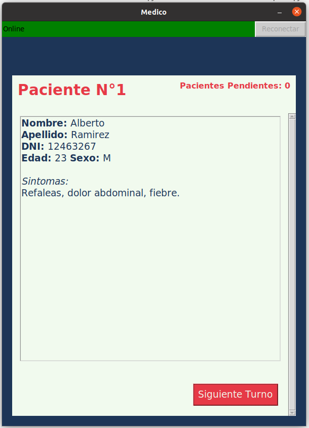

# Integrador - Sistema de Turnos para un Hospital

## Descripción:
El sistema consiste en tres procesos **(recepción, médico y pantalla de turnos)**. **Recepción** se encarga de registrar los nuevos [pacientes](src/libs/README.md#patient-lib) y almacenar el turno en una cola, el **médico** para atender al siguiente [paciente](src/libs/README.md#patient-lib) lee de esa cola y notifica a la **pantalla de turnos** a quien se está atendiendo ahora. La **pantalla de turnos** le muestra a los [pacientes](src/libs/README.md#patient-lib) quien es el siguiente en la cola.

> Realizado con [**Python**](https://www.python.org/) y la libreria grafica [**tkinter**](https://docs.python.org/3/library/tkinter.html).

## Comunicación:
Al ser un sistema con tres procesos **(recepción, médico y pantalla de turnos)**, la comunicación entre los tres esta organizada de forma que los procesos de tipo **recepción** se comunican con los procesos de tipo **médico** a través de una [_fifo_](src/libs/README.md#fifo-lib). Y los procesos de tipo **médico** se comunican con los procesos de tipo **pantalla de turnos** por medio de un [_socket_](https://es.wikipedia.org/wiki/Socket_de_Internet).

## Sincronización:
...

## Galeria:

    
    <h3 align="center"><b><i>Interfaz del Medico</i></b></h3>

