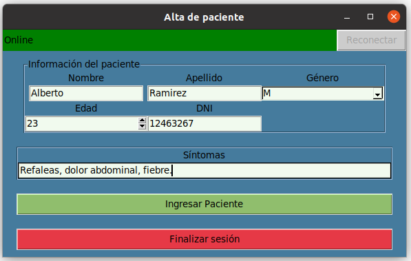

# Integrador - Sistema de Turnos para un Hospital

## Descripción:
Nuestra solución de software se enfoca en la recepción de pacientes en un centro médico. Donde
encontramos dos actores principales que son el recepcionista y el médico mismamente. En el cual, el primero
se encargará de dar de alta a los nuevos pacientes que vayan llegando al establecimiento y el medico se
encargará de ir llamándolos para ser atendidos.
Para la utilización de nuestra solución de software se necesitan ejecutar 4 archivos distintos.
1. El servidor, que se va a encargar de recibir y enviar los datos de los pacientes, es la vía de
   comunicación entre la recepción y el médico.
2. La interfaz de alta de pacientes, por donde el recepcionista va a ingresar todos los datos de los
   pacientes para que sean atendidos
3. La interfaz del médico, donde el medico podrá visualizar si tiene pacientes para llamar y los datos del
   mismo a la hora de ser llamado
4. La interfaz de la sala de espera, esta solo funcionara para comunicar a los pacientes que se
   encuentran esperando su turno de una manera visual si el medico los llamo recientemente
> Realizado con [**Python**](https://www.python.org/) y la libreria grafica [**tkinter**](https://docs.python.org/3/library/tkinter.html).

## Comunicación:
Al ser un sistema con tres procesos **(recepción, médico y pantalla de turnos)**, la comunicación entre los tres esta organizada de forma que los procesos de tipo **recepción**, **médico** y **sala de espera** se comunican con el servidor a través de sockets. El servidor se encarga de sincronizar los mensajes recibidos por las interfaces por medio de distintos [_socket_](https://es.wikipedia.org/wiki/Socket_de_Internet) los cuales se encuentran a la escucha de mensajes que disparan distintos eventos.

## Galeria:

    
    <h3 align="center"><b><i>Interfaz del Medico</i></b></h3>

 
 
 

    
    <h3 align="center"><b><i>Interfaz Recepción</i></b></h3>

 
 
 

    
    <h3 align="center"><b><i>Interfaz Sala de Espera</i></b></h3>

